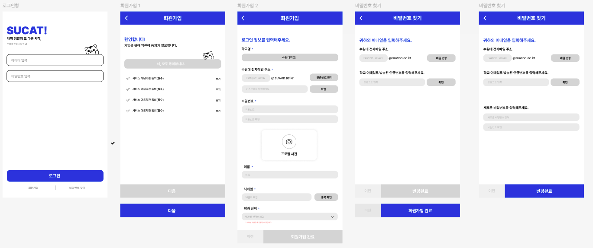

  

# 1. 소개
대학교 전용 이메일을 이용하여 같은 대학교 학생들이 경쟁 구도의 미니게임과 함께 소통할 수 있는 대학생들의 친목 커뮤니티입니다.
게시글 작성과 1대1 채팅이 가능합니다.  
그리고 같은 과 학생들끼리 모여 즐길 수 있는 여러 게임들이 준비되어 있습니다.

## 2. 팀 구성 및 개발 기간
개발 기간 : 2024.02.24 ~ 2024.11.21

| 이름   | 역할                 |
|--------|----------------------|
| 박상민 | 백엔드 (서버)   |
| 정아름 | 백엔드 (서버)   |
| 김지현 | 백엔드 (서버)   |
| 박정우 | 프론트엔드 & 디자인 |
| 강재훈 | 프론트엔드 & 디자인 |
| 김종민 | 게임 개발            |

## 3. 기능

- **회원가입 및 로그인**
  - 대학교 전용 이메일 이용
  - 닉네임 검사
  - 비밀번호 재설정
- **커뮤니티**
  - 게시글 CRUD
  - 좋아요, 댓글 기능
  - 스크랩
  - 게시글 검색
- **소셜 기능**
  - 친구 추가
  - 1대1 채팅
  - 알림 서비스
- **게임**
  - 5가지 게임 탑재
  - 점수 저장 및 랭킹 시스템
- **마이페이지**
  - 프로필 설정

## 4. 구현 이미지

  

  

  

## 5. 기술 스택 및 배포

| 분류 | 사용 기술 |
|------|-----------|
| 프론트엔드 | React, CSS |
| 디자인 | Figma |
| 협업 도구 | Git, GitHub, Notion, Discord |
| 배포 | AWS S3, CloudFront |
| 기타 | REST API, WebSocket |

## 6. 발생한 문제와 해결 과정
> ✏️ 추후 업데이트 예정
